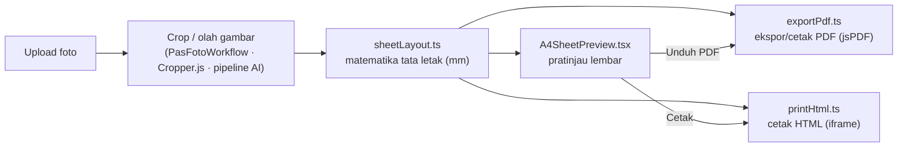
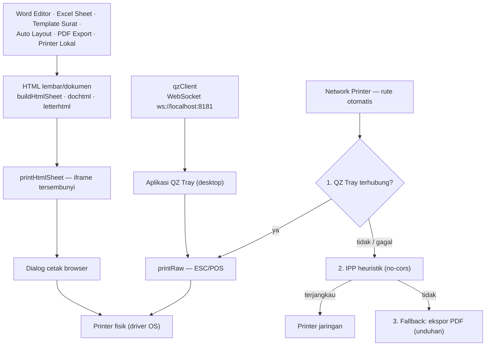

# Printifya

[](https://github.com/29nls/Printifya/releases/latest)
[](https://github.com/29nls/Printifya/releases/latest)
[](https://github.com/29nls/Printifya/releases/latest)
[](LICENSE)

Aplikasi web cetak pas foto & dokumen: studio pas foto, editor dokumen,
pencetakan, dan bantuan AI. Tersedia sebagai **web app** dan **Android APK**.

- **[FEATURES.md](FEATURES.md)** — matriks fitur lengkap semua modul (foto,
  dokumen, print, AI) beserta contoh nama file hasil.
- **[CHANGELOG.md](CHANGELOG.md)** — riwayat perubahan per versi (auto-generated
  dari conventional commits).
- **[docs/project prd.md](docs/project%20prd.md)** — PRD (Product Requirements
  Document) proyek.

> 📱 **Download APK**: [v1.0.0](https://github.com/29nls/Printifya/releases/download/v1.0.0/Printifya.apk)
> (7.3 MB, Android 7.0+, signed release)

## Struktur Modul

```
Printifya
│
├── Photo Studio            → src/modules/photo-studio
│   ├── Pas Foto 2x3        → photo-studio/pas-foto-2x3
│   ├── Pas Foto 3x4        → photo-studio/pas-foto-3x4
│   ├── Pas Foto 4x6        → photo-studio/pas-foto-4x6
│   ├── Visa Photo          → photo-studio/visa-photo
│   └── Custom Size         → photo-studio/custom-size
│
├── Document Studio         → src/modules/document-studio
│   ├── Word Editor         → document-studio/word-editor
│   ├── Excel Sheet         → document-studio/excel-sheet
│   ├── PDF Editor          → document-studio/pdf-editor
│   └── Template Surat      → document-studio/template-surat
│
├── Print Center            → src/modules/print-center
│   ├── Printer Lokal       → print-center/printer-lokal
│   ├── QZ Tray             → print-center/qz-tray
│   ├── Network Printer     → print-center/network-printer
│   └── PDF Export          → print-center/pdf-export
│
└── AI Assistant            → src/modules/ai-assistant
    ├── Auto Crop Face      → ai-assistant/auto-crop-face
    ├── Background Removal  → ai-assistant/background-removal
    ├── Enhance Photo       → ai-assistant/enhance-photo
    └── Auto Layout         → ai-assistant/auto-layout
```

## Cara Kerja

- **`src/modules/registry.ts`** — satu sumber kebenaran untuk pohon modul:
  setiap folder modul diekspor lewat `index.tsx`, lalu didaftarkan di sini
  beserta path rute-nya.
- **Navigasi** — sidebar di `src/App.tsx` dirender otomatis dari `MODULES`;
  menambah modul baru cukup: buat folder + `index.tsx`, lalu daftarkan di
  `registry.ts`. Setiap rute dibungkus error boundary (`ModuleErrorBoundary`)
  agar crash di satu modul tidak melumpuhkan aplikasi.

## Arsitektur Bersama

Modul-modul dibangun di atas infrastruktur bersama sehingga fitur identik
lintas modul tanpa salin-tempel. Peta singkat untuk pendatang baru:

- **`src/modules/photo-studio/shared/PasFotoWorkflow.tsx`** — alur pas foto
  (dipakai kelima modul Photo Studio: 2×3, 3×4, 4×6, visa, custom): upload →
  crop Cropper.js (rasio terkunci, deteksi wajah) → hasil + template lembar +
  ekspor/cetak, termasuk mode "beberapa orang" (auto-fill, opsi ulang,
  multi-halaman, label nama).
- **`photo-studio/shared/A4SheetPreview.tsx`** — pratinjau template lembar
  (A3/A4/A5/R2–R30, orientasi otomatis, mode `src` satu foto atau `srcs`
  banyak foto per sel) — dipakai pas foto & Auto Layout.
- **`photo-studio/shared/sheetLayout.ts`** — **sumber tunggal matematika tata
  letak lembar (mm)** untuk pratinjau/PDF/cetak: `computeSheetLayout` (grid +
  margin sentris), `orientedDims`/`chooseOrientation`, `fitsA4`, `maxCols`/
  `maxRows`, `sheetPageCount`, posisi sel (`sheetCellRect`, `sheetCellAtPoint`)
  dan area label (`sheetLabelBarMm`). Murni komputasi, tanpa jsPDF.
- **`photo-studio/shared/exportPdf.ts`** — ekspor/cetak PDF (jsPDF):
  `exportPasFotoPdf` / `exportLayoutPdf` (unduh `.pdf`) dan `printPasFotoPdf` /
  `printLayoutPdf` (dialog cetak via autoPrint).
- **`print-center/printer-lokal/printHtml.ts`** — jalur cetak alternatif
  (iframe HTML) tanpa jsPDF: `buildHtmlSheet` + `printHtmlSheet`.
- **`src/modules/shared/prefsStorage.ts`** — satu helper akses localStorage
  (`loadJSON` + validator, `saveJSON`, `loadString`/`saveString` untuk kunci
  string mentah, `removeKeys`); tidak ada `localStorage.*` langsung di luar
  helper ini.
- **`src/modules/shared/downloadUrl.ts`** — unduhan satu klik terpusat: buat
  `<a download>` sementara lalu klik, dengan kebijakan revoke blob URL yang
  konsisten (blob di-revoke setelah unduh; `data:` tidak pernah); dipakai
  hampir semua modul yang punya tombol unduh.
- **`src/modules/shared/pasFotoBridge.ts` & `autoLayoutBridge.ts`** — meneruskan
  hasil antar modul: ke alur crop Pas Foto 3×4 ("Jadikan Pas Foto 3x4") atau ke
  Auto Layout ("Susun ke A4") dengan awalan label per modul.
- **`src/modules/shared/createWorkerClient.ts`** — klien Web Worker generik:
  worker dibuat lazy, pekerjaan dikirim dengan id-sequence, balasan dicocokkan
  per-id, `terminate` menolak permintaan tertunda lalu menghentikan worker;
  dipakai upscale-denoise, video-face-enhance, face-enhance, dan enhance-photo.
- **`src/modules/shared/facePipeline.ts`** — sumber tunggal pipeline per-frame
  wajah MURNI (tanpa DOM): `processFramePixels` (deteksi wajah → kotak →
  bentangan histogram → `enhancePixels` → `temporalBlend`), `pickWorkingSize`,
  `NEUTRAL_PARAMS` — dipakai jalur worker DAN thread utama di video-face-enhance
  & face-enhance, jadi kedua jalur menghasilkan piksel identik.
- **`src/modules/shared/audioShared.ts`** — decode AudioBuffer SEKALI lalu
  berbagi instance yang sama persis antar pemakai (`resolveSharedAudioBuffer`);
  dipakai waveform/rekaman Video Face Enhance dan musik latar Slideshow to Video.
- **`src/modules/shared/recordWithAudio.ts`** — rekam stream canvas ke
  WebM/MP4 via MediaRecorder dengan track audio opsional (pola BufferSource →
  MediaStreamAudioDestinationNode, fallback video saja bila muxing tak
  didukung) + **progres byte live**; dipakai Video Face Enhance dan Slideshow
  to Video, siap dipakai modul lain yang merekam animasi/slideshow.
- **`src/modules/shared/SyncedPhotoCompare.tsx`** (+ `syncedCompare.css`) —
  panel banding sebelum/sesudah dengan zoom/pan tersinkron di kedua sisi;
  dipakai Enhance Photo & Face Enhance.

Alur data pratinjau → PDF/cetak (diagram Mermaid):



Tahap crop/olah berbeda per modul (alur pas foto memakai Cropper.js lewat
`PasFotoWorkflow`; modul AI memakai pipeline sendiri — crop otomatis / olah
gambar), tetapi setelah itu semua jalur memakai **matematika tata letak yang
sama**: `sheetLayout` memberi grid & margin ke pratinjau (`A4SheetPreview`),
ekspor PDF (`exportPdf`), dan cetak HTML (`printHtml`) — pratinjau hanyalah
jendela interaksi tempat pengguna memicu ekspor/cetak.

Alur cetak ke printer fisik (diagram Mermaid kedua):



Dua jalur asli: **dialog cetak browser** (modul dokumen/lembar membangun HTML
via `buildHtmlSheet` / `dochtml` / `letterhtml`, dicetak lewat `printHtmlSheet`
yang memakai iframe tersembunyi) dan **raw ESC/POS** (modul QZ Tray — klien
`qzClient` ke aplikasi desktop QZ Tray via WebSocket, `printRaw`). Network
Printer merutekan otomatis dengan fallback: QZ Tray (bila terhubung) → IPP
heuristik (IPP sungguhan diblokir CORS browser) → ekspor PDF yang selalu
berfungsi.

## Menambah Modul Baru

Tiga langkah, memakai pola modul yang sudah ada:

**1. Buat folder + `index.tsx` dengan default export:**

```tsx
// src/modules/ai-assistant/modul-baru/index.tsx
import { useEffect, useState } from "react";
import { loadJSON, saveJSON } from "../../shared/prefsStorage";

export default function ModulBaruPage() {
  // Infrastruktur bersama: preferensi tersimpan lintas sesi lewat prefsStorage
  // (try/catch aman; validator per modul) — tanpa localStorage.* langsung.
  const [opts, setOpts] = useState(
    () => loadJSON("printifya.modul-baru.opts", validateOpts) ?? DEFAULT_OPTS
  );
  useEffect(() => {
    saveJSON("printifya.modul-baru.opts", opts);
  }, [opts]);
  return (
    <div className="panel">
      <h2>Modul Baru</h2>
      {/* konten */}
    </div>
  );
}
```

**2. Daftarkan di `src/modules/registry.ts`** — lazy import + entry di `MODULES`
(sidebar & rute otomatis; setiap rute dibungkus `ModuleErrorBoundary`):

```ts
const ModulBaruPage = lazy(() => import("./ai-assistant/modul-baru"));

{
  id: "modul-baru",
  title: "Modul Baru",
  path: "/ai-assistant/modul-baru",
  icon: "✨",
  description: "Deskripsi singkat yang tampil di sidebar & kartu modul.",
  Component: ModulBaruPage,
}
```

**3. Pakai infrastruktur bersama di atas alih-alih menulis ulang** — ringkas:

- **Pas foto / lembar cetak**: modul foto memakai `PasFotoWorkflow` (crop
  Cropper.js + template lembar + ekspor/cetak); modul yang menyusun lembar
  memakai `sheetLayout` + `A4SheetPreview` untuk pratinjau dan `exportPdf` /
  `printHtmlSheet` untuk hasil akhir — satu hitungan grid & margin untuk semua
  jalur.
- **Persistensi**: semua `localStorage.*` lewat `prefsStorage` (`loadJSON` +
  validator, `saveJSON`, `loadString`/`saveString`, `removeKeys`); tambahkan
  tombol `ResetPreferencesButton` (reset dua-klik) bila modul menyimpan
  preferensi — tiru `optionsStorage.ts` modul yang sudah ada.
- **Terusan antar modul**: `pasFotoBridge` ("Jadikan Pas Foto 3x4") dan
  `autoLayoutBridge` ("Susun ke A4", dengan awalan label per modul).
- **Proses berat**: untuk pipeline gambar yang memblokir UI, tiru pola Web
  Worker + OffscreenCanvas di `upscale-denoise` / `face-enhance` — klien
  generik `createWorkerClient` (id-sequence, terminate saat unmount, fallback
  thread utama).

## Menjalankan

```bash
npm install
npm run dev        # development server (http://localhost:5173)
npm run build      # typecheck + production build
npm run typecheck  # typecheck saja
```

## Android (Capacitor)

Printifya bisa dibangun sebagai aplikasi Android menggunakan
[Capacitor](https://capacitorjs.com/). Aplikasi Android menggunakan WebView
untuk menjalankan web app yang sama persis.

### Prasyarat

- **JDK 17+** — unduh dari [Adoptium](https://adoptium.net/) atau `brew install openjdk@17`
- **Android Studio** — unduh dari [developer.android.com](https://developer.android.com/studio)
- **Android SDK** — terpasang lewat Android Studio SDK Manager (API 36+)

### Build

```bash
npm run android:build   # typecheck + build + sync ke Android
```

### Buka di Android Studio

```bash
npm run android:open    # buka project Android di Android Studio
```

Lalu klik **Run ▶** di Android Studio untuk menginstall ke emulator/perangkat.

### Build APK tanpa Android Studio

```bash
npm run build && npx cap sync android
cd android && ./gradlew assembleDebug
# APK: android/app/build/outputs/apk/debug/app-debug.apk
```

### Plugin Capacitor

| Plugin | Fungsi |
|---|---|
| `@capacitor/core` | Core runtime |
| `@capacitor/camera` | Akses kamera & galeri |
| `@capacitor/filesystem` | Baca/tulis file |
| `@capacitor/share` | Native share sheet (bagikan PDF) |
| `@capacitor/splash-screen` | Splash screen custom |
| `@capacitor/app` | App info & lifecycle |
| `@capacitor/browser` | Buka URL eksternal |
| `@capacitor/preferences` | Local storage key-value |
| `@capacitor/device` | Info perangkat |

### Catatan

- Fitur QZ Tray (WebSocket ke localhost) tidak tersedia di Android — gunakan
  fallback PDF Export atau cetak via dialog bawaan.
- Fitur Network Printer (IPP) juga terbatas di Android WebView.
- Upload foto dari galeri berfungsi via `<input type="file" />` (WebView).
- Ekspor PDF tetap berfungsi — file diunduh ke folder Download perangkat.
- **Native Share** — Tombol "Bagikan" di PDF Export menggunakan Android share
  sheet untuk membagikan PDF via WhatsApp, Email, Bluetooth, dll. Di web,
  fitur ini menggunakan Web Share API atau fallback ke download.

### Auto-Update (GitHub Releases)

Printifya mendukung auto-update untuk aplikasi Android menggunakan GitHub Releases.
Saat versi baru tersedia, pengguna akan melihat dialog untuk mengunduh dan
menginstall update.

#### Cara Kerja

1. App mengecek GitHub Releases API **saat startup** dan **setiap 6 jam**
2. Delay 5 detik setelah startup untuk memastikan app loaded
3. Jika versi baru ditemukan, dialog update muncul dengan:
   - Versi saat ini → versi baru
   - Release notes (auto-generated dari changelog)
   - Progress bar saat download
4. User klik **"Update Sekarang"** → APK diunduh → Android installer terbuka
5. User bisa **skip versi** tertentu ("Nanti Saja") — versi itu tidak akan ditanya lagi

#### Check Interval

| Trigger | Keterangan |
|---|---|
| App startup | Delay 5 detik, lalu cek |
| Setiap 6 jam | Background check otomatis |
| Manual | User bisa pull-to-refresh (future) |

> **Tip**: Update check hanya berjalan di Android (via Capacitor). Di web,
> fitur ini tidak aktif karena tidak ada mekanisme install APK.

#### Setup GitHub Releases

**1. Update konfigurasi di `src/App.tsx`:**

```ts
const GITHUB_OWNER = "printifya";  // Ganti dengan owner kamu
const GITHUB_REPO = "printifya-app";  // Ganti dengan repo kamu
```

**2. Create GitHub Personal Access Token:**

- Buka GitHub Settings → Developer Settings → Personal Access Tokens
- Buat token baru dengan scope `repo`
- Simpan token ini untuk digunakan saat release

**3. Release Manual:**

```bash
# Bump version & create release
node scripts/release.mjs 1.2.0

# Atau dry-run dulu
node scripts/release.mjs 1.2.0 --dry-run

# Push tags ke GitHub
git push && git push --tags
```

**4. Release Otomatis (GitHub Actions):**

```bash
# Create & push tag
git tag v1.2.0
git push origin v1.2.0
```

GitHub Actions akan otomatis:
- Build web assets
- Build release APK (signed)
- Create GitHub Release dengan APK ter-attach

#### Release Script

| Command | Fungsi |
|---|---|
| `npm run release 1.2.0` | **Full release** (build + commit + push + tag + release) |
| `npm run release:dry 1.2.0` | Dry run tanpa publish |
| `npm run release:no-push 1.2.0` | Build + commit tanpa push |
| `npm run release:local 1.2.0` | Build APK saja (no git, no release) |

**Auto-Changelog:** Release script otomatis generate changelog dari commit messages
(conventional commits: `feat`, `fix`, `perf`, dll) ke `CHANGELOG.md` dan GitHub Release notes.

**Full release flow:**
```bash
npm run release 1.2.0
# Output:
# ✅ Build web assets
# ✅ Build release APK (signed)
# ✅ Git commit: "chore: release v1.2.0"
# ✅ Git push to GitHub
# ✅ Git tag: v1.2.0
# ✅ Push tag to GitHub
# ✅ Create GitHub Release with APK
# ✅ Users auto-update within 6 hours
```

#### Alur Auto-Update

```
GitHub Release (v1.2.0 + Printifya.apk)
         ↓
GitHub Releases API (latest)
         ↓
App Startup (setiap 6 jam)
         ↓
┌─────────────────────────────┐
│ Versi Baru?                 │
│ v1.1.0 → v1.2.0            │
└─────────────┬───────────────┘
              ↓ Yes
┌─────────────────────────────┐
│ Dialog Update Muncul        │
│ [Update Sekarang] [Nanti]   │
└─────────────┬───────────────┘
              ↓ Update Sekarang
┌─────────────────────────────┐
│ Download APK (progress bar) │
│ 7.3 MB — 50%               │
└─────────────┬───────────────┘
              ↓
┌─────────────────────────────┐
│ Package Installer Muncul    │
│ [Install] [Batal]           │
└─────────────────────────────┘
```

#### Files

| File | Fungsi |
|---|---|
| `src/modules/shared/autoUpdate.ts` | Core update logic + GitHub API parser |
| `src/components/UpdateDialog.tsx` | UI dialog |
| `src/components/useAutoUpdate.ts` | React hook |
| `scripts/release.mjs` | Release automation script |
| `.github/workflows/release.yml` | GitHub Actions workflow |
