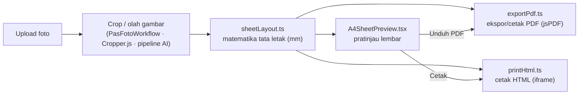
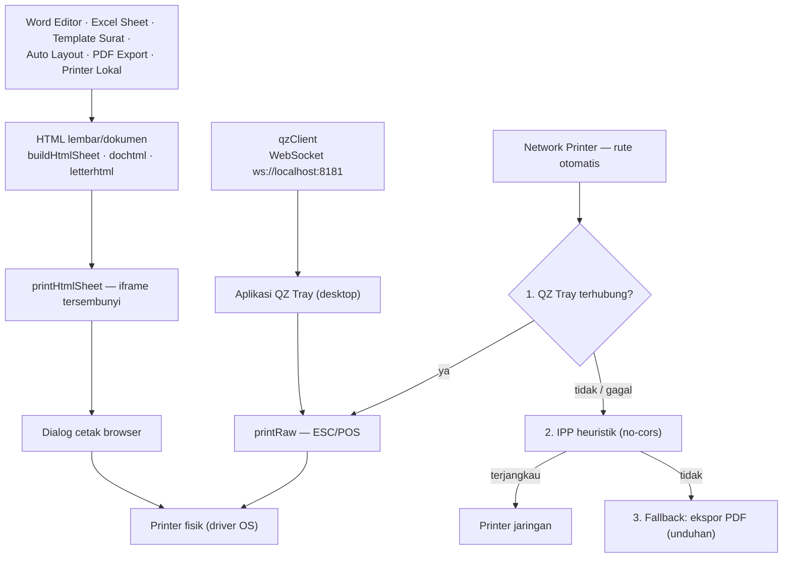

# Printifya

Aplikasi web cetak pas foto & dokumen: studio pas foto, editor dokumen,
pencetakan, dan bantuan AI.

- **[FEATURES.md](FEATURES.md)** — matriks fitur lengkap semua modul (foto,
  dokumen, print, AI) beserta contoh nama file hasil.
- **[docs/project prd.md](docs/project%20prd.md)** — PRD (Product Requirements
  Document) proyek.

## Struktur Modul

```
Printifya
│
├── Photo Studio            → src/modules/photo-studio
│   ├── Pas Foto 2x3        → photo-studio/pas-foto-2x3
│   ├── Pas Foto 3x4        → photo-studio/pas-foto-3x4
│   ├── Pas Foto 4x6        → photo-studio/pas-foto-4x6
│   ├── Visa Photo          → photo-studio/visa-photo
│   └── Custom Size         → photo-studio/custom-size
│
├── Document Studio         → src/modules/document-studio
│   ├── Word Editor         → document-studio/word-editor
│   ├── Excel Sheet         → document-studio/excel-sheet
│   ├── PDF Editor          → document-studio/pdf-editor
│   └── Template Surat      → document-studio/template-surat
│
├── Print Center            → src/modules/print-center
│   ├── Printer Lokal       → print-center/printer-lokal
│   ├── QZ Tray             → print-center/qz-tray
│   ├── Network Printer     → print-center/network-printer
│   └── PDF Export          → print-center/pdf-export
│
└── AI Assistant            → src/modules/ai-assistant
    ├── Auto Crop Face      → ai-assistant/auto-crop-face
    ├── Background Removal  → ai-assistant/background-removal
    ├── Enhance Photo       → ai-assistant/enhance-photo
    └── Auto Layout         → ai-assistant/auto-layout
```

## Cara Kerja

- **`src/modules/registry.ts`** — satu sumber kebenaran untuk pohon modul:
  setiap folder modul diekspor lewat `index.tsx`, lalu didaftarkan di sini
  beserta path rute-nya.
- **Navigasi** — sidebar di `src/App.tsx` dirender otomatis dari `MODULES`;
  menambah modul baru cukup: buat folder + `index.tsx`, lalu daftarkan di
  `registry.ts`. Setiap rute dibungkus error boundary (`ModuleErrorBoundary`)
  agar crash di satu modul tidak melumpuhkan aplikasi.

## Arsitektur Bersama

Modul-modul dibangun di atas infrastruktur bersama sehingga fitur identik
lintas modul tanpa salin-tempel. Peta singkat untuk pendatang baru:

- **`src/modules/photo-studio/shared/PasFotoWorkflow.tsx`** — alur pas foto
  (dipakai kelima modul Photo Studio: 2×3, 3×4, 4×6, visa, custom): upload →
  crop Cropper.js (rasio terkunci, deteksi wajah) → hasil + template lembar +
  ekspor/cetak, termasuk mode "beberapa orang" (auto-fill, opsi ulang,
  multi-halaman, label nama).
- **`photo-studio/shared/A4SheetPreview.tsx`** — pratinjau template lembar
  (A3/A4/A5/R2–R30, orientasi otomatis, mode `src` satu foto atau `srcs`
  banyak foto per sel) — dipakai pas foto & Auto Layout.
- **`photo-studio/shared/sheetLayout.ts`** — **sumber tunggal matematika tata
  letak lembar (mm)** untuk pratinjau/PDF/cetak: `computeSheetLayout` (grid +
  margin sentris), `orientedDims`/`chooseOrientation`, `fitsA4`, `maxCols`/
  `maxRows`, `sheetPageCount`, posisi sel (`sheetCellRect`, `sheetCellAtPoint`)
  dan area label (`sheetLabelBarMm`). Murni komputasi, tanpa jsPDF.
- **`photo-studio/shared/exportPdf.ts`** — ekspor/cetak PDF (jsPDF):
  `exportPasFotoPdf` / `exportLayoutPdf` (unduh `.pdf`) dan `printPasFotoPdf` /
  `printLayoutPdf` (dialog cetak via autoPrint).
- **`print-center/printer-lokal/printHtml.ts`** — jalur cetak alternatif
  (iframe HTML) tanpa jsPDF: `buildHtmlSheet` + `printHtmlSheet`.
- **`src/modules/shared/prefsStorage.ts`** — satu helper akses localStorage
  (`loadJSON` + validator, `saveJSON`, `loadString`/`saveString` untuk kunci
  string mentah, `removeKeys`); tidak ada `localStorage.*` langsung di luar
  helper ini.
- **`src/modules/shared/pasFotoBridge.ts` & `autoLayoutBridge.ts`** — meneruskan
  hasil antar modul: ke alur crop Pas Foto 3×4 ("Jadikan Pas Foto 3x4") atau ke
  Auto Layout ("Susun ke A4") dengan awalan label per modul.
- **`src/modules/shared/recordWithAudio.ts`** — rekam stream canvas ke
  WebM/MP4 via MediaRecorder dengan track audio opsional (pola BufferSource →
  MediaStreamAudioDestinationNode, fallback video saja bila muxing tak
  didukung); dipakai Video Face Enhance, siap dipakai modul lain yang merekam
  animasi/slideshow.

Alur data pratinjau → PDF/cetak (diagram Mermaid):



Tahap crop/olah berbeda per modul (alur pas foto memakai Cropper.js lewat
`PasFotoWorkflow`; modul AI memakai pipeline sendiri — crop otomatis / olah
gambar), tetapi setelah itu semua jalur memakai **matematika tata letak yang
sama**: `sheetLayout` memberi grid & margin ke pratinjau (`A4SheetPreview`),
ekspor PDF (`exportPdf`), dan cetak HTML (`printHtml`) — pratinjau hanyalah
jendela interaksi tempat pengguna memicu ekspor/cetak.

Alur cetak ke printer fisik (diagram Mermaid kedua):



Dua jalur asli: **dialog cetak browser** (modul dokumen/lembar membangun HTML
via `buildHtmlSheet` / `dochtml` / `letterhtml`, dicetak lewat `printHtmlSheet`
yang memakai iframe tersembunyi) dan **raw ESC/POS** (modul QZ Tray — klien
`qzClient` ke aplikasi desktop QZ Tray via WebSocket, `printRaw`). Network
Printer merutekan otomatis dengan fallback: QZ Tray (bila terhubung) → IPP
heuristik (IPP sungguhan diblokir CORS browser) → ekspor PDF yang selalu
berfungsi.

## Menambah Modul Baru

Tiga langkah, memakai pola modul yang sudah ada:

**1. Buat folder + `index.tsx` dengan default export:**

```tsx
// src/modules/ai-assistant/modul-baru/index.tsx
import { useEffect, useState } from "react";
import { loadJSON, saveJSON } from "../../shared/prefsStorage";

export default function ModulBaruPage() {
  // Infrastruktur bersama: preferensi tersimpan lintas sesi lewat prefsStorage
  // (try/catch aman; validator per modul) — tanpa localStorage.* langsung.
  const [opts, setOpts] = useState(
    () => loadJSON("printifya.modul-baru.opts", validateOpts) ?? DEFAULT_OPTS
  );
  useEffect(() => {
    saveJSON("printifya.modul-baru.opts", opts);
  }, [opts]);
  return (
    <div className="panel">
      <h2>Modul Baru</h2>
      {/* konten */}
    </div>
  );
}
```

**2. Daftarkan di `src/modules/registry.ts`** — lazy import + entry di `MODULES`
(sidebar & rute otomatis; setiap rute dibungkus `ModuleErrorBoundary`):

```ts
const ModulBaruPage = lazy(() => import("./ai-assistant/modul-baru"));

{
  id: "modul-baru",
  title: "Modul Baru",
  path: "/ai-assistant/modul-baru",
  icon: "✨",
  description: "Deskripsi singkat yang tampil di sidebar & kartu modul.",
  Component: ModulBaruPage,
}
```

**3. Pakai infrastruktur bersama di atas alih-alih menulis ulang** — ringkas:

- **Pas foto / lembar cetak**: modul foto memakai `PasFotoWorkflow` (crop
  Cropper.js + template lembar + ekspor/cetak); modul yang menyusun lembar
  memakai `sheetLayout` + `A4SheetPreview` untuk pratinjau dan `exportPdf` /
  `printHtmlSheet` untuk hasil akhir — satu hitungan grid & margin untuk semua
  jalur.
- **Persistensi**: semua `localStorage.*` lewat `prefsStorage` (`loadJSON` +
  validator, `saveJSON`, `loadString`/`saveString`, `removeKeys`); tambahkan
  tombol `ResetPreferencesButton` (reset dua-klik) bila modul menyimpan
  preferensi — tiru `optionsStorage.ts` modul yang sudah ada.
- **Terusan antar modul**: `pasFotoBridge` ("Jadikan Pas Foto 3x4") dan
  `autoLayoutBridge` ("Susun ke A4", dengan awalan label per modul).
- **Proses berat**: untuk pipeline gambar yang memblokir UI, tiru pola Web
  Worker + OffscreenCanvas di `upscale-denoise` (antrean per-id, fallback
  thread utama).

## Menjalankan

```bash
npm install
npm run dev        # development server (http://localhost:5173)
npm run build      # typecheck + production build
npm run typecheck  # typecheck saja
```
