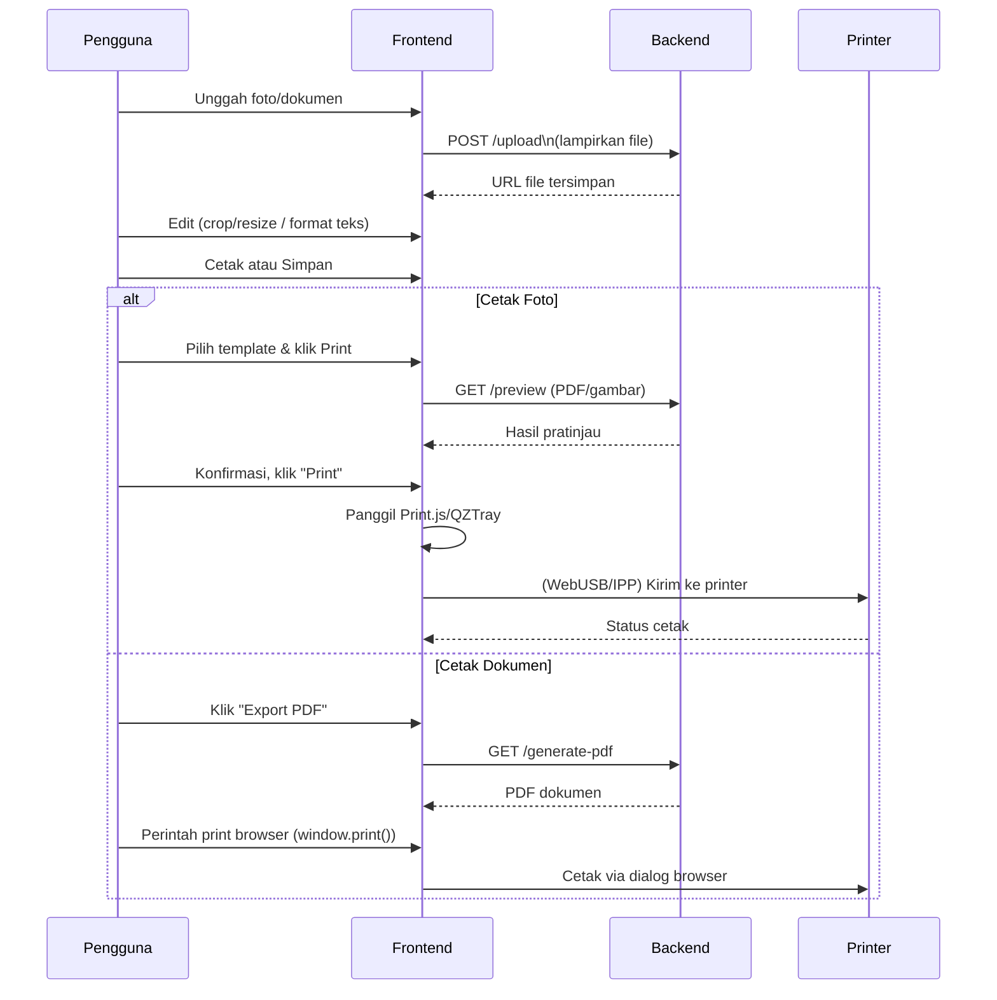

# Ringkasan Eksekutif  
Aplikasi web yang diusulkan akan memungkinkan pengguna mengunggah dan mengedit foto (khususnya pas foto dengan ukuran standar 2×3 cm, 3×4 cm, 4×6 cm) serta membuat/mengedit dokumen mirip Word/Excel secara online, lalu mencetak hasilnya ke printer lokal. Fitur utama meliputi antarmuka edit foto (memotong, mengubah ukuran, efek sederhana), antarmuka edit dokumen (format teks kaya, tabel, spreadsheet sederhana), pemilihan template halaman foto untuk mencetak banyak salinan pada satu kertas, dan pratinjau cetak. Aplikasi harus responsif, aman, dan kompatibel dengan browser modern dan perangkat mobile. Teknologi yang disarankan antara lain React atau Vue di frontend, perpustakaan pengolah gambar seperti Fabric.js, Cropper.js atau Toast UI Image Editor; editor dokumen seperti TipTap atau Quill; serta backend Node.js/Express, database PostgreSQL/MySQL, dan penyimpanan objek (mis. AWS S3). Untuk koneksi printer lokal, dapat dipertimbangkan API WebUSB/Web Bluetooth (meski terbatas) serta solusi helper seperti **QZ Tray** (open-source) atau Print.js sebagai fallback. Arsitektur akan berbasis RESTful API, memisahkan layanan frontend, backend, dan penyimpanan. Pengembangan diperkirakan memerlukan beberapa puluh person-week dengan fase MVP (autentikasi, upload foto, crop, cetak dasar) hingga fitur lanjut (editor dokumen, multiplatform, integrasi printer).  

## Kebutuhan Fungsional  
- **Pengeditan Foto:** Pengguna dapat mengunggah gambar, memotong (crop) sesuai rasio pas foto (mis. 2×3, 3×4, 4×6 cm), memutar, mengubah kecerahan/kontras, dan menerapkan filter sederhana. Sistem menyediakan template halaman foto untuk mencetak beberapa salinan foto dalam satu halaman (mis. 2×3 cm dalam format A4). Keluaran foto harus memenuhi resolusi cetak standar (mis. 300 DPI: 2×3 cm ≈255×330 piksel). Juga ada opsi menambah watermark atau teks (logo studio, tanggal, dll.). Setelah editing, pengguna dapat melihat **pratinjau cetak** dengan margin dan orientasi kertas.  
- **Pengeditan Dokumen:** Pengguna dapat membuat atau mengunggah dokumen teks dan spreadsheet sederhana. Fitur pengeditan teks kaya (bold, italic, header, list, tabel, sisip gambar) dan kemampuan spreadsheet dasar (sel, formula sederhana). Editor dapat berbasis WYSIWYG (mis. TipTap, Quill) dan mampu mengimpor/mengeskpor format seperti DOCX atau XLSX jika memungkinkan, atau minimal mencetak ke PDF. Dokumen disimpan ke backend dan dapat dibagikan atau dicetak.  
- **Template & Pratinjau Cetak:** Pilihan template cetak untuk foto (jumlah foto per halaman, ukuran kertas 4×6 in, A4, dan lain-lain). Pratinjau cetak menampilkan representasi halaman akhir. Pengguna dapat memilih kertas, orientasi, dan kualitas cetak.  
- **Koneksi Printer Lokal:** Aplikasi menyediakan opsi cetak ke printer lokal. Jika memungkinkan, gunakan **WebUSB**/ **Web Bluetooth** untuk printer USB/Bluetooth, atau protokol jaringan (IPP) untuk printer jaringan. Disediakan juga solusi fallback: export ke PDF atau menggunakan helper app (mis. QZ Tray yang mendukung berbagai koneksi printer). Aplikasi harus menangani kegagalan koneksi (mis. printer tidak terdeteksi).  
- **Manajemen Pengguna:** Autentikasi pengguna (login/registrasi), profil pengguna, penyimpanan foto/dokumen pribadi. Opsi berbagi atau kolaborasi dapat disiapkan (akses terbatas).  
- **Administrasi & Logging:** Panel admin (opsional) untuk manajemen template, kuota cetak, monitoring penggunaan. Logging aktivitas untuk audit dan debugging.  

## Persona Pengguna  
- **Pencari Paspor/Foto Identitas:** Menginginkan cara cepat membuat pasfoto standar (ukurannya 2×3 cm, 3×4 cm, 4×6 cm) dengan printer biasa. Mungkin tidak terlalu paham editing, butuh UI sederhana.  
- **Admin Kantor/HR:** Membutuhkan cetakan massal (banyak dokumen & foto) misalnya untuk foto karyawan atau formulir. Memerlukan template cetak dan koneksi printer handal.  
- **Guru/Operator Sekolah:** Sering mencetak foto murid (pasfoto kelas) dan laporan. Butuh integrasi editor sederhana dan cetak langsung.  
- **Pengguna Profesional:** Fotografer atau studio foto dengan tuntutan edit lebih kompleks (filter, watermark, export berkualitas). Menghargai fitur lanjutan (layering, pengaturan warna) dan stabilitas.  

## Alur Pengguna (UX Flows)  
- **Alur Pengeditan Foto:**  
  1. Pengguna masuk ke modul “Edit Foto” dan mengunggah gambar (via drag-drop atau file dialog).  
  2. Aplikasi menampilkan kanvas editor foto. Pengguna menggunakan tool cropping untuk memilih rasio pas foto (2×3, 3×4, 4×6).  
  3. Jika perlu, menerapkan efek (brightness/contrast, filter). Preview perubahannya ditampilkan real-time.  
  4. Pengguna memilih template cetak (mis. 6 salinan 2×3 per halaman A4). Aplikasi otomatis mengelompokkan potongan foto dalam tata letak halaman.  
  5. Pengguna mengakses pratinjau halaman cetak dengan tata letak final, lalu mengklik “Cetak”.  
  6. Aplikasi menjalankan *print preview* atau mengirim perintah cetak ke browser/helper (mis. Print.js, QZ Tray). Jika ada kegagalan (printer offline, error), muncul pesan penanganan kesalahan.  
- **Alur Pengeditan Dokumen:**  
  1. Pengguna membuka modul “Editor Dokumen”. Pilih “Baru” atau “Unggah”.  
  2. Editor teks kaya (seperti TipTap) muncul. Pengguna mengetik isi, menambahkan tabel, gambar, menyisipkan data. Semua perubahan disimpan otomatis ke backend via API.  
  3. Tersedia tombol *Print* atau *Export PDF*. Pilihan kertas dan orientasi bisa ditentukan sebelum cetak.  
  4. Aplikasi menampilkan pratinjau dokumen (mirip PDF viewer). Pengguna konfirmasi lalu aplikasi mencetak dokumen.  
- **Alur Pemilihan Template & Pratinjau Cetak:**  
  Pengguna memilih preset (mis. “4×6 (A4) – 8 foto per halaman”) atau membuat tata letak kustom. Sistem menghitung margin agar pas di printer. Setelah pemilihan, tampil jendela pratinjau yang memperlihatkan tampilan persis kertas cetak (termasuk bagian kosong). 
- **Alur Koneksi Printer Lokal:**  
  1. Saat pertama kali akan mencetak, pengguna mungkin perlu menginisialisasi koneksi printer. Mis. klik “Hubungkan Printer” → tampil dialog izin WebUSB atau Web Bluetooth.  
  2. Jika menggunakan QZ Tray, pengguna harus menginstal aplikasi pendamping dan memberikan izin di browser.  
  3. Setelah koneksi aktif, pengguna memilih printer (jika ada banyak), lalu klik “Cetak”.  
  4. Aplikasi melakukan perintah cetak via API yang dipilih (mis. QZ Tray atau print dialog browser).  
  5. Menangani kesalahan: jika printer tidak ditemukan, tampilkan instruksi troubleshooting.  

## Kebutuhan Non-Fungsional  
- **Kinerja:** Pengolahan gambar (resizing, filter) dilakukan di klien (Canvas API/WebGL) untuk mengurangi beban server. Gunakan WebWorkers untuk mencegah UI hang jika image besar. Caching gambar di frontend mempercepat preview. Backend harus menangani penyimpanan dan konversi file (mis. generate PDF) secara efisien.  
- **Keamanan:** Seluruh komunikasi dienkripsi (HTTPS). Sanitasi unggahan file (pencegahan malware/JS di gambar). Autentikasi aman (JWT atau OAuth 2.0) dan pengaturan hak akses (pengguna hanya boleh mengedit file miliknya). Proteksi CSRF, XSS di editor teks. Data sensitif (foto, dokumen) dienkripsi saat disimpan di server. Backup rutin.  
- **Skalabilitas:** Arsitektur stateless (frontend statis, backend container). Bisa skala horizontal dengan load balancer. Penyimpanan objek (S3/GCP Storage) untuk menampung banyak file. Database terhubung via cluster (untuk beban besar). Gunakan serverless functions (mis. AWS Lambda) untuk tugas berat (resizing) agar auto-skala.  
- **Lintas Browser (Cross-Browser):** Dukung Chrome, Firefox, Edge, Safari terbaru. Beberapa API (WebUSB/Web Bluetooth) belum didukung semua browser; sediakan fallback (print dialog standar, PDF). Pastikan fallback CSS dan Canvas bekerja di semua browser.  
- **Responsif & Mobile:** UI adaptif untuk tablet/mobile. Editor foto/tombol besar, gestur sentuh (untuk memindah crop box). Editor teks sederhana (dropdown toolbar) kompatibel layar sentuh.  

## Rekomendasi Teknologi  

### Kerangka Kerja Frontend  
- **React:** Populer dengan ekosistem luas (menurut survei, ~40% developer menggunakan React). Komunitas besar, pustaka pendukung (state management, UI libraries). React bersama Next.js cocok untuk aplikasi modern.  
- **Vue.js:** Ringan dan mudah dipelajari, populer di Asia. Komponen single-file memudahkan integrasi (bisa di-cite react/populer?).  
- **Angular:** Framework penuh (TypeScript, terstruktur) cocok untuk tim besar.  
- **Alternatif:** Svelte/SvelteKit menjanjikan kinerja tinggi (bundle lebih kecil), bisa dipertimbangkan untuk kinerja maksimal.  

### Perpustakaan Pengeditan Gambar (Image Editing)  
| Pustaka            | Fitur Utama                                   | Lisensi         | Matang (Stars)             | Dukungan Browser    |
|--------------------|-----------------------------------------------|-----------------|----------------------------|---------------------|
| **Fabric.js**      | Canvas object model, filter gambar, SVG↔Canvas | MIT             | ⭐️⭐️⭐️⭐️ (∼14k★)         | Modern (IE9+)       |
| **Cropper.js**     | Fokus crop/resize, aspect ratio, rotate    | MIT             | ⭐️⭐️⭐️⭐️ (∼13k★)         | All modern          |
| **Toast UI Image Editor** | Editor full GUI, draw, shapes, filter   | MIT             | ⭐️⭐️⭐️ (∼8k★)           | Modern             |
| **Filerobot**      | Editor fitur lengkap (filter, watermark, tema) | Open-source?    | ⭐️⭐️⭐️ (unknown★)        | Modern             |
| **CamanJS**        | Filter & efek, layering (update terakhir lama) | MIT (lama)      | ⭐️⭐️ (few updates)       | Modern             |
| **Jimp (Node.js)** | Server-side image (resize, blur, teks)      | MIT             | ⭐️⭐️⭐️ (∼12k★)          | N/A (backend)      |
| **glfx.js**        | WebGL filters (GPU-accelerated)           | BSD             | ⭐️⭐️ (maintenance?)       | Modern (WebGL)     |
| **Pintura (komersial)** | Editor lengkap, annotation, UI modern | Komersial (LGPL) | ⭐️⭐️⭐️⭐️⭐️ (4.9 rating) | Modern             |

Catatan: Lisensi penting untuk distribusi. Banyak opsi open-source MIT (Fabric, Cropper, Toast UI, Jimp). Pintura (produk komersial) menawarkan fitur premium (cropping canggih, annotasi).

### Perpustakaan Editor Dokumen  
- **Rich Text Editor:**  
  - *TipTap* (progresif, **MIT**, ProseMirror-based, Vue/React) – gratis, open-source.  
  - *Quill.js* (**BSD-3**, 37k★) – ringan, API bersih, mendukung cross-browser.  
  - *Lexical* (Facebook, **MIT**, fokus aksesibilitas & kolaborasi, 23k★) – modern, React-first.  
  - *Slate* (MIT) – framework customizable, tapi masih beta.  
  - *CKEditor 5* – GPL2+ (open source) dengan opsi lisensi komersial; fitur enterprise (kolaborasi real-time, export Word/PDF) tapi memerlukan biaya jika bebas GPL tidak terpenuhi.  
  - *TinyMCE* – Gratis v6 (MIT), namun modul premium memerlukan lisensi (muncul di WordPress, 2.3k★).  
- **Spreadsheet/Data Grid:**  
  - *AG Grid Community* (MIT) – fitur grid esensial (sort, filter, grouping); gratis untuk core grid.  
  - *Jspreadsheet CE* (MIT, 7k★) – spreadsheet UI mirip Excel, multi-data format (JSON, CSV).  
  - *Handsontable* – dulunya MIT, kini berlisensi non-komersial/komersial (skip jika budget unlimited).  
  - *SheetJS (xlsx)* – parsing Excel di frontend (tidak editor UI).  

### Backend dan Penyimpanan Data  
- **Backend Server:** Node.js dengan framework seperti Express atau NestJS (baik untuk REST API). Bisa juga Python (Django/Flask) atau Java (Spring) tergantung tim.  
- **Database:** Relasional (PostgreSQL/MySQL) untuk data pengguna/dokumen; atau NoSQL (MongoDB) jika lebih fleksibel. Data foto/dokumen bisa disimpan di S3/GCP Storage, tidak di DB.  
- **Penyimpanan File:** Cloud Storage (AWS S3, Google Cloud Storage) untuk image/dokumen. Atau Azure Blob Storage. Keunggulan: tahan banting, skala tanpa henti.  
- **Autentikasi:** JWT atau OAuth 2.0 (contoh: login Google, Facebook). Gunakan library teruji (Passport.js untuk Node, atau Auth0). Data sensitif di-backup terenkripsi.  
- **Keamanan Backend:** Gunakan HTTPS, helmet/CORS, validasi input, rate-limiting.  

### API Cetak Lokal & Protokol Printer  
- **WebUSB/Web Bluetooth:** Sebagian browser (Chrome) mendukung WebUSB untuk komunikasi USB langsung. Namun, *WebUSB masih belum berfungsi di Windows karena driver printer mengklaim perangkat*. Web Bluetooth terbatas ke printer BLE tertentu. Jadi pendekatan ini ada risiko tidak universal.  
- **IPP (Internet Printing Protocol):** Untuk printer jaringan/IP, bisa menggunakan pustaka seperti PrintNode atau langsung mengirim job IPP via backend. IPP umumnya memerlukan akses jaringan ke server CUPS/IPP printer.  
- **CUPS:** Jika backend dijalankan di server (Linux), bisa memicu CUPS. Namun sulit diakses klien browser. Lebih cocok jika aplikasi perusahaan dengan server lokal.  
- **Native Helper Apps:** *QZ Tray* – Aplikasi pendamping (Java) yang terpasang di komputer pengguna, mendengarkan perintah dari browser melalui WebSockets. Mendukung banyak koneksi printer (COM, USB, IP) dan banyak platform. Populer di POS/retail. Kelebihan: cross-browser, autoprint, raw printing. Lisensi open source (LGPL).  
- **Library JavaScript:** *Print.js* – Cetak PDF/gambar/HTML lewat iframe dengan antarmuka sederhana. Cocok untuk menggantikan fungsi `window.print()` (mis. cetak elemen HTML dengan gaya). Kelemahan: tidak terhubung langsung ke printer (cukup panggil dialog cetak browser).  
- **Web Print API (Eksperimental):** Beberapa browser mulai menguji Web Print API, tapi belum umum.  

### Deployment dan Hosting  
- **Cloud Provider:** AWS/GCP/Azure. Contoh AWS: gunakan EC2 atau Elastic Beanstalk untuk backend, S3 untuk statik dan penyimpanan file, RDS (PostgreSQL). Atau gunakan container (ECS/EKS). Frontend (React) bisa dihosting sebagai static di S3+CloudFront. Alternatif: Netlify/Vercel untuk frontend, dan serverless (AWS Lambda, Firebase Functions) untuk backend sederhana.  
- **CI/CD:** Pipeline otomatis (GitHub Actions/GitLab CI) untuk build, test, dan deploy.  
- **Perkiraan Biaya:** Tanpa batasan budget, gunakan layanan terkelola. Namun gambaran kasar: skala kecil (puluhan pengguna/hari) bisa ditekan di ~$50–100/bulan (mis. 1–2 EC2 kecil, RDS mikro, S3 minimal). Skala menengah (~ratusan pengguna) ~$500–1000/bulan (multi-instance, auto-scaling, CDN, backup). Skala besar (ribuan pengguna sekaligus) bisa beberapa ribu dolar per bulan (multi-regional, load balancer, caching, streaming resources). Biaya aktual tergantung ukuran penyimpanan, bandwidth, dan jenis server.  

## Arsitektur Sistem (Diagram)  
```mermaid
graph TD
  subgraph Frontend
    A[Browser Pengguna] --> B[Web App (React/Vue)]
  end
  subgraph Backend
    B --> C[API Server (Node.js)]
    C --> D[Database (PostgreSQL)]
    C --> E[File Storage (S3)]
    C --> F[Service Cetak Lokal]
  end
  subgraph Koneksi Cetak
    F -->|WebUSB/WebSockets| G[Printer Lokal/QZ Tray]
    F -->|IPP/Network| H[Printer Jaringan]
  end
  A -- HTTP/REST --> C
  A -- WebSocket --> F
  E -- upload/download --> B
```
*Diagram arsitektur: Browser klien berkomunikasi dengan API server; data disimpan di DB/File Storage; modul cetak (Print Service) mengirim perintah ke printer lokal (melalui WebUSB/WebSockets) atau jaringan (IPP).*  

## Diagram Alur (Sequence)  

*Contoh alur: pengguna mengunggah file, melakukan editing, kemudian mencetak. Pada cetak foto, sistem menghasilkan pratinjau yang dikirim ke printer via WebUSB atau helper app (QZ Tray). Pada dokumen, cetak dilakukan lewat dialog browser.*  

## Model Data (Contoh)  
- **Photo:** `{ id, user_id, url, width, height, dpi, created_at }`  
- **PrintTemplate:** `{ id, name, image_per_page, page_size, margins, orientation }`  
- **Document:** `{ id, user_id, title, content (HTML/JSON), created_at }`  
- **PrintJob:** `{ id, user_id, type("photo"/"doc"), template_id, status("pending","done","error"), created_at }`  

## Endpoint API (Contoh)  
- `POST /api/photos` – Unggah foto. *Payload:* form-data (file image). *Response:* `{ photoId, url }`.  
- `POST /api/photos/{id}/crop` – Proses crop. *Payload:* `{ x, y, width, height }`. *Response:* `{ newImageUrl }`.  
- `GET /api/photos/{id}/preview` – Dapatkan data halaman cetak (mis. PDF atau gambar komposit).  
- `POST /api/documents` – Simpan dokumen. *Payload:* `{ title, contentHTML }`.  
- `GET /api/documents/{id}` – Ambil dokumen.  
- `GET /api/documents/{id}/export` – Hasilkan/ambil PDF.  
- `POST /api/print` – Kirim job cetak. *Payload:* `{ photoId or docId, templateId }`.  

*Contoh JSON (crop photo):*  
```json
POST /api/photos/123/crop
{
  "x": 50,
  "y": 20,
  "width": 300,
  "height": 400
}
```
*Respon:*  
```json
{
  "newImageUrl": "https://.../photo_123_crop.png"
}
```  

## Perbandingan Pustaka/Tools  

| Kategori       | Nama Pustaka / Alat  | Fitur Utama                                     | Lisensi     | Maturity   | Browser Support       |
|----------------|----------------------|-------------------------------------------------|-------------|------------|-----------------------|
| **Image Editor** | Fabric.js            | Canvas objek (rotate, filter, tek, SVG support) | MIT         | Stabil (∼14k★) | Chrome, FF, Edge, Safari (modern) |
|                | Cropper.js           | Crop/zoom gambar, aspect ratio, rotate          | MIT         | Stabil (∼13k★) | Semua modern         |
|                | Toast UI Image Editor| GUI lengkap, gambar shapes, filter (gambar) | MIT         | Matang (∼8k★)  | Modern              |
|                | Filerobot            | Banyak filter, watermark, tema custom | Open src?   | Relatif baru (src) | Modern           |
|                | Jimp (Node)          | Resize, blur, teks, manipulasi batch gambar| MIT         | Stabil (∼12k★) | Backend (Node)      |
| **Rich Text**  | TipTap               | Headless ProseMirror, React/Vue, plugin        | MIT | Populer    | Modern              |
|                | Quill.js             | Editor ringan, JSON Delta, plugin (patern dari Medium) | BSD-3 | Stabil (∼37k★) | Modern              |
|                | Lexical              | Framework (Facebook) dengan kolaborasi real-time| MIT | Relatif baru (23k★) | Modern          |
|                | Slate                | Editor fully-customizable (React-based)        | MIT | Beta (4k★)   | Modern              |
|                | CKEditor 5           | WYSIWYG enterprise (kolaborasi, export Word/PDF)| GPL2+/Komersial | Stabil (9k★) | Modern  |
|                | TinyMCE (core v6)    | WYSIWYG popular (cloud/editor)                 | MIT (v6) | Stabil (2.3k★) | Modern         |
| **Data Grid/Sheet**| AG Grid Community  | Data grid advanced (filter, sort, grouping)    | MIT  | Stabil (18k★) | Chrome, FF, Edge, Safari |
|                | Jspreadsheet CE      | Spreadsheet UI (Excel-like, CSV/JSON/XLSX)     | MIT   | Aktif (7k★)  | Modern              |
|                | Handsontable (old)   | Grid & spreadsheet (non-com)                   | Non-komersial        | Legacy      | Modern              |

## Rencana Implementasi  
1. **MVP (8–12 minggu):**  
   - *Minggu 1–2:* Persiapan proyek (repo, CI/CD, setup env). Desain data model awal.  
   - *Minggu 3–5:* Pengembangan modul foto: upload, crop (Cropper.js/Fabric.js), template cetak (tata letak grid), pratinjau PDF (wkhtmltopdf atau jsPDF).  
   - *Minggu 6–7:* Integrasi printer: implementasi Print.js untuk cetak image/HTML, basic WebUSB/QZ setup.  
   - *Minggu 8:* UI/UX finalisasi (fokus kemudahan), pengujian internal.  
   - *Minggu 9–12:* Pengembangan modul dokumen: integrasi TipTap/Quill untuk teks, fitur table, export PDF (puppeteer/jsPDF), cetak dokumen.  
2. **Fitur Lanjutan (6–8 minggu):**  
   - Multi-user (autentikasi, penyimpanan per user).  
   - Editor spreadsheet sederhana (Jspreadsheet/AG Grid) jika diperlukan.  
   - Fitur admin (kelola template, monitoring).  
   - Optimasi performa (WebWorkers, CDN).  
3. **Pengujian & Peluncuran (4–6 minggu):**  
   - Pengujian QA (fungsi utama, keamanan, kompatibilitas).  
   - Perbaikan bug, dokumentasi pengguna (instruksi cetak).  
   - Uji coba beta dengan pengguna terbatas.  
   - Deployment penuh, monitoring pasca-rilis.  

*Estimasi upaya:* Total ~20–30 orang-minggu, tergantung ukuran tim (Lebih besar mempercepat).  

### Risiko & Mitigasi  
- **Kompatibilitas Printer:** WebUSB tidak didukung di Windows. *Mitigasi:* Sediakan fallback PDF/download atau gunakan QZ Tray (cross-platform). Dokumentasi jelas (mis. “izinkan akses USB”).  
- **Performa Image Besar:** Proses Crop/Filter berat di browser. *Mitigasi:* Gunakan WebGL (fabric.js, glfx) atau proses di server dengan Node (Jimp). Gunakan worker/thread. Batasi ukuran upload (resize ke batas maksimum).  
- **Keamanan File:** Unggahan file raw berisiko (skrip tertanam). *Mitigasi:* Validasi jenis file (hanya image), strip metadata, simpan di server terisolasi. XSS di editor dihindari dengan sanitasi HTML.  
- **Kebutuhan Lisensi:** Beberapa library (CKEditor, Handsontable) berlisensi komersial. *Mitigasi:* Utamakan opsi MIT/BSD gratis. Untuk fitur enterprise, pertimbangkan membeli lisensi jika diperlukan.  
- **Integrasi Mobile:** UI kompleks bisa sulit di mobile. *Mitigasi:* Rancang tata letak responsif, input sentuh. Batasi fitur pada perangkat kecil (simpan opsi lanjutan di versi desktop).  

## Aksesibilitas & Internasionalisasi  
- **Aksesibilitas (a11y):** Sertakan teks alternatif untuk gambar, gunakan elemen HTML semantik di editor, navigasi keyboard penuh (mis. untuk crop box, toolbar editor teks), kontras warna memadai. Pastikan editor teks dapat digunakan dengan pembaca layar (ARIA).  
- **Internasionalisasi (i18n):** Sediakan dukungan multi-bahasa (terutama Bahasa Indonesia dan Inggris). Semua teks UI diake di file lokalisasi. Tanggal/waktu/kalender mengikuti locale. Gunakan pustaka i18n (i18next atau Vue I18n).  

## Dokumentasi Fungsional (PRD)  

- **Fitur Utama:**  
  - Foto Pasfoto: upload, crop preset, filter sederhana,  simpan ke cloud, cetak ke template.  
  - Dokumen: editor teks, tabel, simpan/export (HTML/PDF), cetak.  
  - Otentikasi pengguna, manajemen akun.  
  - Pemilihan template cetak (foto): jumlah foto per halaman, ukuran.  
  - Print Preview: tampilan halaman final sebelum cetak.  
  - Koneksi Printer: integrasi WebUSB/QZ Tray.  
  - Setting: Bahasa antarmuka, tema (light/dark), opsi cetak (kertas, margin).  

- **Acceptance Criteria:**  
  - Foto paspor dapat dicetak sesuai ukuran standar (diperiksa dimensi output).  
  - Editor dokumen menyimpan format (bold, list, tabel) dan menghasilkan PDF yang layak cetak.  
  - Setiap template cetak mencetak sesuai preview (foto tidak terpotong).  
  - Koneksi printer berhasil di browser modern (atau muncul instruksi jika tidak tersedia).  
  - Kecepatan respon antarmuka < 200ms untuk sebagian besar aksi (dilaporkan statistik).  

- **Deskripsi Wireframe (contoh):**  
  - *Halaman Utama:* Tombol/menu “Edit Foto” dan “Edit Dokumen”. Login/Profil di sudut.  
  - *Editor Foto:* Bagian kiri: toolbar crop, rotate, filter. Bagian tengah: kanvas foto. Bagian bawah/kanan: preview template cetak, tombol Cetak.  
  - *Editor Dokumen:* Toolbar atas (format teks), area teks besar di tengah. Sidebar (opsi format lanjutan/tabel). Tombol “Save/Print” di atas.  
  - *Pratinjau Cetak:* Tampilkan halaman (mis. preview PDF) dengan tombol “Kembali/Edit” atau “Cetak”.  

- **Kasus Uji (QA):**  
  1. Upload JPG/PNG, crop preset 3×4, cetak hasil dengan Print.js → ukuran dan orientasi benar.  
  2. Edit teks: bold, italic, buat list dan tabel, export PDF → format terjaga.  
  3. Uji pada Chrome/Firefox/Safari: semua fungsi utama (crop, simpan, print) berjalan.  
  4. Uji tanpa koneksi printer (atau matikan WebUSB) → fallback dialog cetak/pdf bekerja.  
  5. Cek reaktif di mobile: crop menggunakan sentuhan, toolbar scrollable.  
  6. Uji aksesibilitas: navigasi via keyboard (tab, enter) dapat mengaktifkan semua kontrol.  

- **Rencana Rollout:**  
  - **Alpha:** Tim dev internal (tahap awal, fix bug kritis).  
  - **Beta (Pilot):** Beberapa pengguna atau organisasi (mis. sekolah/kantor) untuk feedback UX dan kompatibilitas printer.  
  - **RC/Produksi:** Perbaikan berdasarkan beta, lalu rilis publik (cloud-hosted).  
  - **Dokumentasi & Pelatihan:** Sediakan panduan penggunaan (video/berkas), serta dukungan customer service (FAQ).  

## Edge Cases Cetak & Troubleshooting  
- **Printer Tidak Terdeteksi:** Tampilkan pesan “Tidak menemukan printer.” Tawarkan solusi: cek kabel, restart printer, pasang QZ Tray dan muat ulang situs.  
- **Format File Error:** Jika file tak kompatibel (mis. foto korup), berikan notifikasi dan opsi upload ulang. Cegah script injection dengan validasi file type.  
- **Ukuran Berlebih:** Jika pengguna memprint banyak foto per halaman, periksa DPI jadi tidak terlalu kecil. Tampilkan peringatan jika jumlah gambar melebihi kemampuan cetak berkualitas.  
- **Masalah Jaringan/IP:** Jika cetak via IPP gagal (printer jaringan mati), fallback ke PDF.  
- **Print.js Limit:** Print.js terikat same-origin; jika PDF/gambar di-domain lain, minta convert ke data URI atau gunakan backend sebagai proxy.  

## Visualisasi Antar Muka (Contoh)  
  
*Contoh antarmuka editor gambar berbasis web (dengan fitur crop, filter, watermark). Editor sejenis dapat digunakan sebagai acuan UI aplikasi.*  

Dengan pendekatan di atas, aplikasi diharapkan memenuhi semua kebutuhan fungsional dan non-fungsional, sambil mempertahankan performa dan keamanan. Semua rekomendasi didukung oleh pustaka atau sumber tepercaya. Implementasi bertahap dan pengujian menyeluruh akan memastikan solusi yang matang dan siap pakai.  

**Sumber:** Referensi di atas diambil dari dokumentasi resmi pustaka dan artikel teknologi terkini, termasuk sumber lokal untuk ukuran pasfoto dan blog teknis tentang pencetakan web.